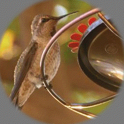
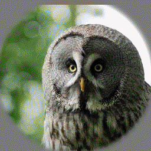
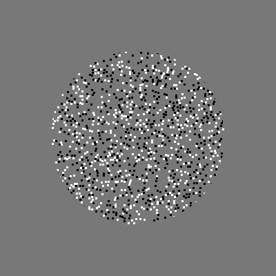
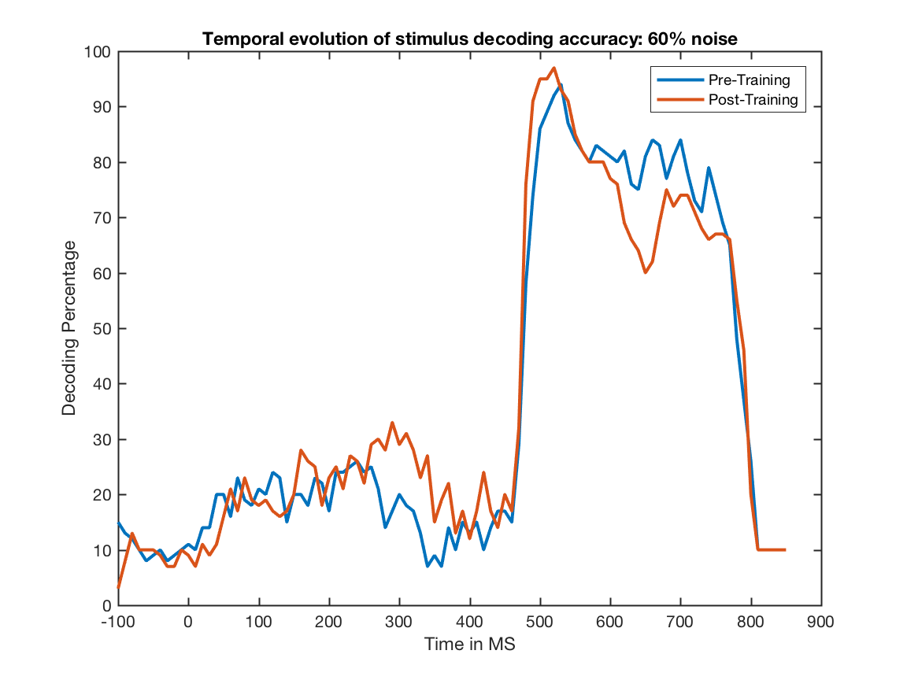
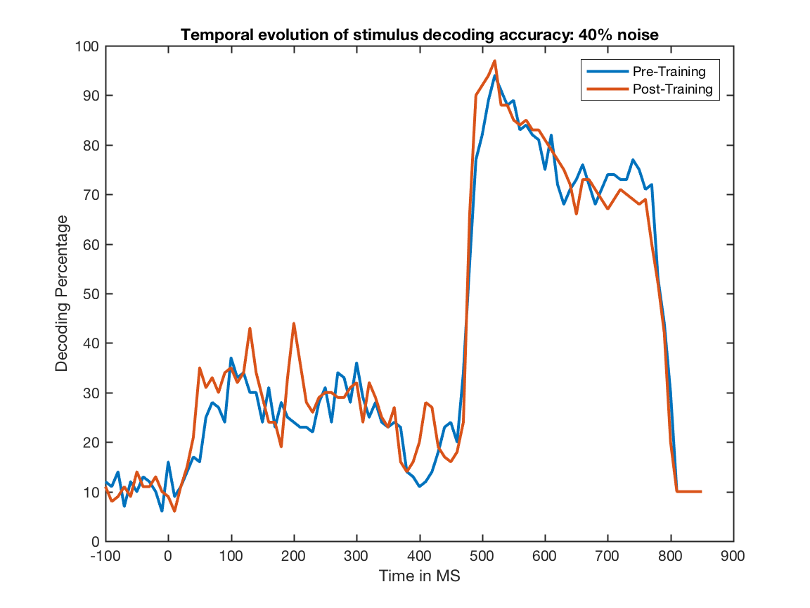
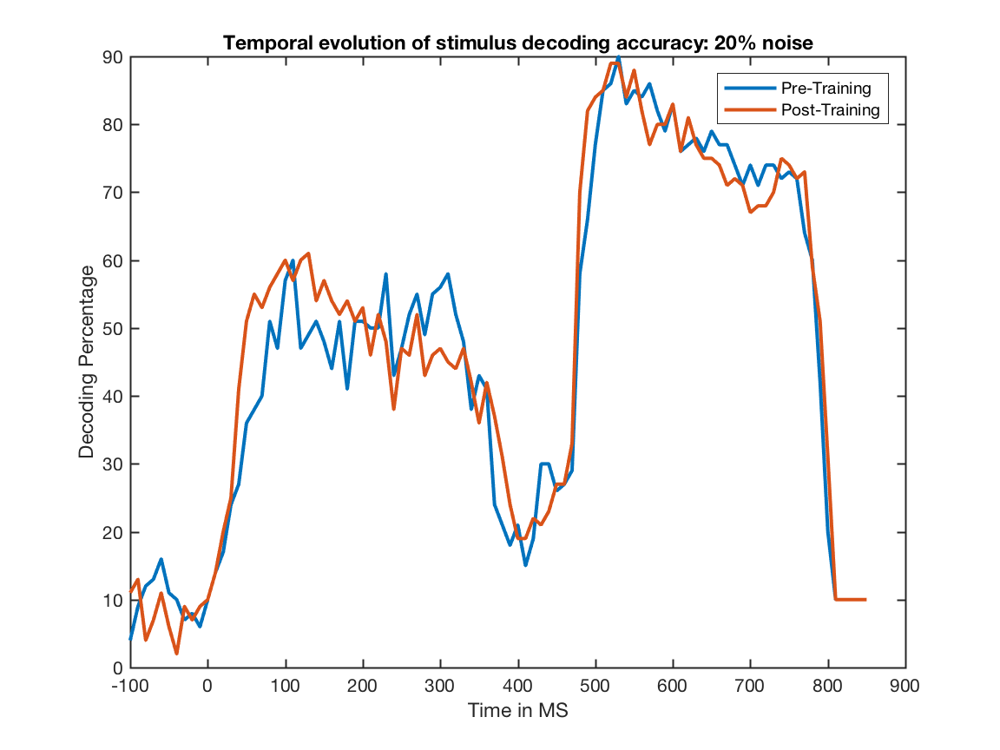
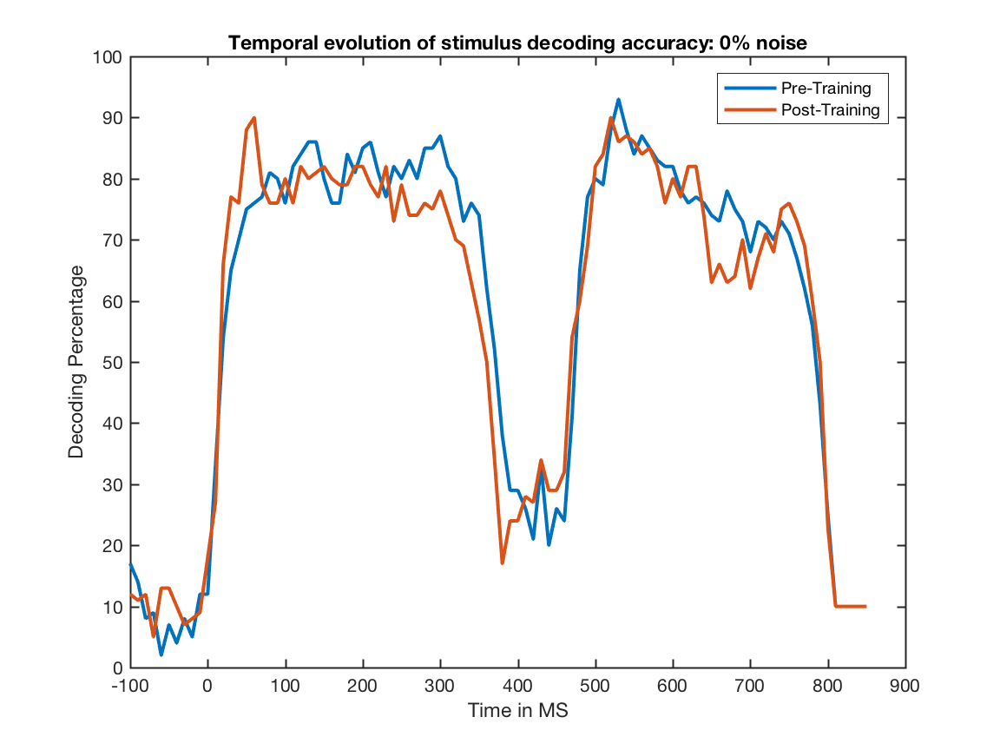
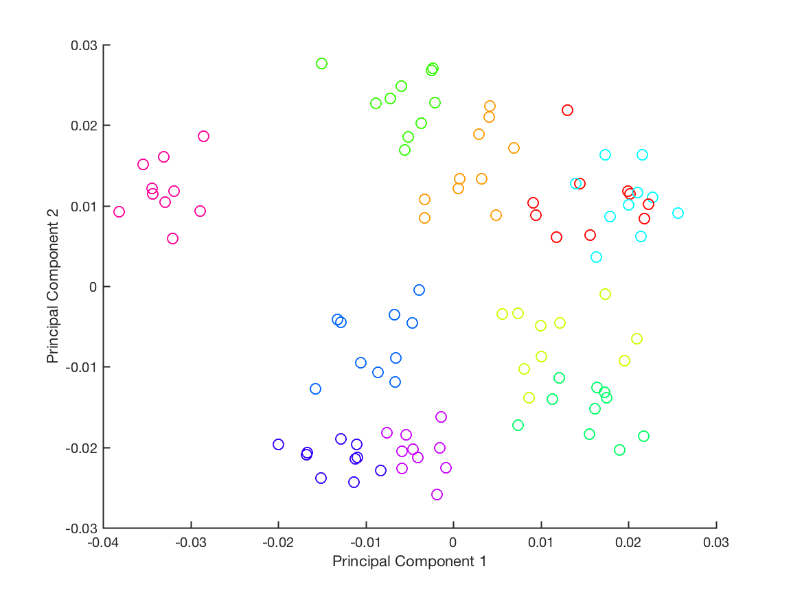

Noise Experiment 
================
=========
Motivation/Introduction
       =========

We would like to see if V1 and V2 neurons can decode familiar images better under noisy situations than novel images.  

We know repeated exposure to a set of stimuli will produce the familiarity effect. Yet, the functional impact or advantages of familiarity effect has not been demonstrated.  In this study, we hypothesize that familiarity training might modify the recurrent circuitry which can change the population code of the neurons to make them either encode information more efficiently or be able to discriminate the familiar stimuli better. To test this hypothesis, we evaluate the population code of neurons (in terms of their stimulus decodability or discriminability) before and subsequent to familiar training. 

========
Method/Protocol
    ========

sample stimuli without noise

sample 20% noise mask

The experimental protocol is as follows: 
Day 1: we did four tests to get baseline assessment of the cells: (1) mapping receptive fields of all the neurons using horizontal and vertical bars; (2)  testing their orientation tuning; (3) testing neural responses to 15 noise patterns  for each of the four noise levels (15 repeats) to see how the neurons responded to the noise patterns alone -- each of these 15 noise patterns will be superimposed on to images to be trained and tested; (4) test 50 stimuli x 15 noise patterns x 4 noise levels (0, 20, 40 and 60%)  (1 repeat) – this allows us to evaluate stimulus selectivity of the neurons at different noise levels (averaged across noise pattern per noise level).  XX + XX +  900 + 3000  trials.

Day 2:  We started the training process. 10 images are corrupted with 10 noise patterns for each of 4 noise levels, resulting in 400 conditions. Each condition is repeated 10 times, resulting in 4000 trials.  In each trial,  the stimulus is first presented with noise corruption (300 ms), followed by a 150 ms gray screen gap, and then the stimulus is presented again without noise corruption (350 ms).  Stimuli in different noise level were consecutively:  the first 1000 trials is the 60% noise level stimuli, followed by 40%, and 20% and 0%.  Note: the monkey sees the clear  image 1000 time this first day (in the second stimulus presentation). In fact, the monkey also see each clear image 100 times for the first stimulus presentation (for the 0% noise case).  This may provide an opportunity to study functional connectivity between neurons, particularly for the second image presentation (no noise corruption) because there are 1000 trials for each stimulus.  It might also be possible to study functional connectivity for the image at each noise level (100 repeats) – though there are 10 different noise patterns, but maybe we can average that out.  However, the primary purpose is to assess  how well the stimulus can be decoded based on the population code.  We can potentially compare the functional connectivity between the first presentation (noise corrupted) and the second presentation in each session. 

Day 3:   The same 10 stimuli, but in only two noise patterns, each presented 50 times for each noise level. Double check if the order is descending or ascending in noise level.  This again provides 1000 exposure each of the stimulus. Focusing on only two noise levels, allow us to (1) study the familiarity to the noise patterns, (2) compute the functional connectivity of the images for each noise patterns (50 trials each); (3) decoding noise patterns versus decoding stimuli – familiarity to noise patterns? Is there?

Day 4:  Repeat Day 2.

Day 5:  We used 10 familiar stimuli along with 10 novel images for 12 different noise patterns each presented once for each noise level.  

========
Preliminary Analysis
    ========
    
Temporal decoding was performed using SVM on 50 ms windows on training days.  

An interesting finding is that in the decoding of 60% noise, when the noisy stimuli is removed, the decoding continues and there is an initial spike in decoding when the de-noised stimuli is presented.  

In the decoding of the 0% noise, in the initial onset of stimuli, the post-training decoding is high immediately whereas it ramps up in the pre-training scenario.  

